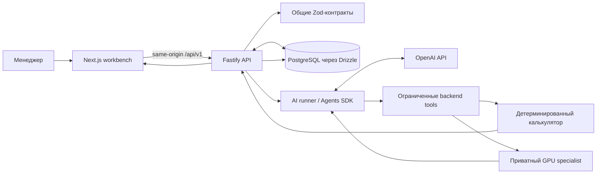

# Atlas — расчёт пополнения запасов с проверяемым AI-агентом

Atlas помогает менеджеру по закупкам подготовить, проверить и утвердить заказ на пополнение склада. Количества рассчитывает детерминированный backend; AI-агент вызывает реальные инструменты системы и объясняет ход обработки, а решение об утверждении остаётся за человеком.

## Проблема

В кейсе «Электрокомплект» менеджеры вручную сводят продажи, остатки, поставки и сезонность, часто в таблицах. Из-за этого медленно обнаруживаются дефицит и избыток, а крупная разовая продажа может исказить оценку регулярного спроса. Ошибка в количестве связывает оборотный капитал или приводит к отсутствию нужных компонентов. Для расчёта важно видеть и результат, и данные, на которых он основан.

## Решение

Atlas принимает нормализованный набор данных, проверяет его и сохраняет снимок. Затем агент изучает спрос и события через ограниченные инструменты, а backend детерминированно рассчитывает рекомендации. Менеджер видит основания и предупреждения, редактирует черновик, подтверждает предупреждения, утверждает конкретную ревизию и выгружает утверждённые строки в CSV.

**Данные → анализ → вызовы инструментов → расчёт backend → сохранённый черновик → проверка человеком → утверждённая ревизия → CSV.**

Это не чат, который только предлагает текст: агент вызывает операции над данными приложения, а бизнес-результат создаётся и проверяется кодом backend. Система не отправляет заказ поставщику.

## Демонстрационный сценарий

1. Менеджер выбирает демонстрационный набор данных, склад и категорию.
2. Запускает расчёт пополнения.
3. Агент проверяет спрос, классифицирует крупные события и вызывает расчёт заказов.
4. Backend сохраняет результат и ревизию; интерфейс показывает рекомендации по поставщикам, количества, основания, события и статусы OpenAI/GPU.
5. Менеджер при необходимости меняет количество с указанием причины. Изменение создаёт новую ревизию; запрос со старой ревизией отклоняется.
6. Менеджер подтверждает необходимые предупреждения и утверждает актуальную ревизию.
7. Скачивает CSV и может повторно открыть тот же утверждённый результат.

Seed содержит синтетическую историю за 24 месяца и шесть SKU. Демонстрационные данные не являются данными партнёра.

## Реализованные возможности

- Импорт проверенного нормализованного JSON с сохранением неизменяемого снимка набора данных.
- Детерминированный расчёт спроса и рекомендаций по пополнению с объяснениями.
- OpenAI Agents SDK с реальными ограниченными инструментами анализа и расчёта.
- Частная граница GPU-специалиста для классификации крупных событий; при недоступности GPU статус честно переходит в degraded-режим с подтверждением предупреждения человеком.
- Черновики заказов по поставщикам, редактирование количеств с причиной и защита от устаревшей ревизии.
- Подтверждение предупреждений, утверждение ревизии и аудит действий.
- CSV только для утверждённой ревизии; интерфейс и объяснения поддерживают русский и английский языки.
- Повторяемый синтетический seed и локальный браузерный end-to-end сценарий.

## Архитектура AI-агента

Агент реализован в `packages/ai` на OpenAI Agents SDK. В подтверждённом live-запуске использовался OpenAI GPT-4.1; модель задаётся конфигурацией. Агент получает ограниченные наблюдения, а не прямой доступ к базе или произвольным API. Он вызывает три backend-инструмента в фиксированном порядке:

- `inspectDemand` — получить агрегированное представление спроса;
- `classifyEvents` — обработать события продаж через specialist boundary;
- `calculateOrders` — запросить детерминированный расчёт backend.

Инструменты не принимают от модели произвольные количества заказа. Количества, проверки и сохранение принадлежат backend. AI возвращает структурированное решение и ссылки на результаты инструментов; интерфейс показывает события выполнения, не скрытые рассуждения модели. Вызовы ограничены по времени, числу ходов и повторов.

GPU-специалист — отдельный приватный сервис, вызываемый только AI-адаптером. В записанном сквозном прогоне использовался Brev с NVIDIA L4 и Qwen2.5-1.5B через llama.cpp CUDA. При отсутствии проверенной GPU-вычислительной активности система не выдаёт фиктивный результат: специалист и GPU-доказательство отсутствуют, а соответствующее предупреждение требует подтверждения.

## Архитектура системы



## Структура репозитория

```text
apps/
  api/                 Fastify routes, валидация, расчёт и workflow заказов
  web/                 Next.js workbench, локализация и браузерный E2E
packages/
  ai/                  OpenAI agent, tools и GPU client boundary
  contracts/           Общие строгие Zod-схемы и выведенные типы
  db/                  Drizzle schema, миграции, seed и persistence
infra/brev/            Конфигурация и доказательства GPU deployment
docs/                  Кейс, спецификации, контракты и отчёты проверок
```

## Технологии

| Уровень | Технологии | Назначение |
|---|---|---|
| Frontend | Next.js, React, TypeScript | Рабочее место менеджера и локализованный workflow |
| Backend | Node.js, Fastify, TypeScript | HTTP API, бизнес-проверки, расчёты и ревизии |
| AI | OpenAI Agents SDK, OpenAI API | Управление последовательностью реальных ограниченных tool calls |
| GPU specialist | Brev GPU, NVIDIA L4, llama.cpp CUDA, Qwen2.5-1.5B | Классификация крупных событий в проверенном live-запуске |
| Database | PostgreSQL, Drizzle ORM | Снимки данных, расчёты, строки заказов и аудит |
| Контракты | Zod, `@atlas/contracts` | Единая runtime-валидация запросов, данных и ответов |
| Тестирование | Node test runner через `tsx`, Playwright-подобный локальный Chrome harness | Проверки пакетов и браузерный сквозной сценарий |
| Инфраструктура | pnpm workspaces, Docker Compose | Монорепозиторий и локальный запуск web/API/PostgreSQL |

## API и контракты инструментов

Браузер обращается к same-origin `/api/v1`; web проксирует запросы в Fastify API. API и пакеты используют общие строгие Zod-схемы из `packages/contracts`. AI-инструменты ограничены бизнес-операциями backend и не имеют SQL-доступа.

Основные маршруты:

- `GET/POST /api/v1/datasets` — список и импорт нормализованных наборов данных;
- `POST /api/v1/runs` и `GET /api/v1/runs/:id` — запуск и чтение расчёта;
- `PATCH /api/v1/runs/:id/lines` — изменение строки с проверкой ревизии;
- `POST /api/v1/runs/:id/approve` — утверждение актуальной ревизии;
- `GET /api/v1/runs/:id/export?revision=…&locale=…` — CSV утверждённой версии.

Контракты подробно описаны в [`docs/api.md`](docs/api.md) и [`docs/ai-contract.md`](docs/ai-contract.md). Партнёрский формат 1С не подтверждён, поэтому CSV не следует считать совместимым с конкретной конфигурацией 1С.

## Запуск

### Требования

- Node.js **22.16.x**;
- pnpm **11.15.1**;
- Docker с Docker Compose;
- Google Chrome нужен только для локального браузерного E2E.

Локальный базовый Compose запускает PostgreSQL 16.9, API и web на `http://localhost:3000`. GPU specialist настраивается отдельно и не требуется для честного degraded-режима.

### Установка и окружение

```bash
git clone https://github.com/BAITC-Hacks/hack-801b451b-atlas.git
cd hack-801b451b-atlas
pnpm install --frozen-lockfile
cp .env.example .env
```

В PowerShell вместо последней команды: `Copy-Item .env.example .env`.

Установите непустой `POSTGRES_PASSWORD`. Для живого запуска агента добавьте `OPENAI_API_KEY` и задайте `OPENAI_MODEL` (в проверенном прогоне применялся `gpt-4.1-2025-04-14`). API-ключ хранится только на серверной стороне в `.env`; не помещайте его в `NEXT_PUBLIC_*` переменные. Без ключа нельзя считать live-вызов OpenAI проверенным. GPU-поля оставьте настроенными только для соответствующего GPU deployment; пустая/недоступная GPU должна отображаться как degraded, а не как успех.

| Переменная | Нужна локально | Назначение |
|---|---|---|
| `POSTGRES_PASSWORD` | Да | Пароль PostgreSQL в Docker Compose; задайте локальное значение |
| `DATABASE_URL` | Для запуска пакетов вне Compose | Подключение к PostgreSQL; внутри Compose API получает URL из конфигурации сервиса |
| `OPENAI_API_KEY` | Для live AI | Серверный ключ OpenAI; не публиковать и не коммитить |
| `OPENAI_MODEL` | Для live AI | Идентификатор используемой модели |
| `GPU_SERVICE_URL` | Только для GPU deployment | Внутренний адрес GPU specialist |
| `GPU_MODEL_ID` | Только для GPU deployment | Идентификатор модели specialist |
| `GPU_VERIFICATION_PATH` | Только для GPU deployment | Путь к проверочным данным runtime |
| `API_HOST` | Обычно значение `.env.example` | Адрес привязки API |
| `WEB_ORIGIN` | Обычно значение `.env.example` | Разрешённый origin браузерного приложения |
| `API_INTERNAL_URL` | Обычно значение `.env.example` | Адрес API, используемый web-контейнером |
| `DEMO_OPERATOR` | Нет, есть значение по умолчанию | Имя локального оператора для demo-аудита; не является аутентификацией |

### Запуск сервисов и базы

```bash
docker compose up --build -d
docker compose exec -T api pnpm --filter @atlas/db migrate
docker compose exec -T api pnpm --filter @atlas/db seed
```

Откройте [http://localhost:3000](http://localhost:3000). Seed идемпотентен и создаёт синтетический набор данных. Для остановки: `docker compose down`. Команда `docker compose down -v` удалит локальный том базы.

В корне нет общего `pnpm dev`; для разработки web при уже доступных API и БД существует команда:

```bash
pnpm --filter @atlas/web dev
```

## Сборка и тесты

Команды из корня репозитория:

```bash
pnpm -r --if-present typecheck
pnpm -r --if-present build

pnpm --filter @atlas/contracts exec tsx --test test/contracts.test.ts
pnpm --filter @atlas/db exec tsx --test test/persistence.test.ts
pnpm --filter @atlas/ai exec tsx --test test/config.test.ts test/openai.test.ts test/gpu.test.ts test/run.test.ts
pnpm --filter @atlas/api exec tsx --test test/import.test.ts test/calculation.test.ts test/runs.test.ts test/orders.test.ts
pnpm --filter @atlas/web exec tsx --test test/transport.test.ts
```

Пакетные тесты проверяют контракты, persistence, AI/GPU статусы, импорт, расчёт, изменения/утверждения и web transport. Отдельного полного набора E2E для всех внешних партнёрских интеграций в проекте нет.

Браузерный E2E запускается на работающем Compose stack, с seed, Chrome и настроенным ключом OpenAI:

```powershell
$env:ATLAS_BASE_URL = 'http://localhost:3000'
pnpm --filter @atlas/web e2e:local
```

Если Chrome находится не по стандартному пути, задайте `ATLAS_CHROME_PATH`. Сценарий проверяет расчёт, редактирование, конфликт устаревшей ревизии, подтверждение предупреждений, утверждение, скачивание CSV и повторное чтение сохранённого состояния. GPU может быть недоступна: тест принимает только честный degraded-статус.

## Пример выполнения агента

```text
Запрос менеджера: рассчитать пополнение выбранного склада
  → inspectDemand()
  → classifyEvents() → GPU specialist либо честный degraded-результат
  → calculateOrders() → детерминированный расчёт backend
  → сохранение черновика и ревизии в PostgreSQL
  → менеджер проверяет строки и предупреждения
  → edit / acknowledge / approve
  → CSV утверждённой ревизии
```

Агент не утверждает заказ и не отправляет его поставщику. Все количественные результаты принадлежат backend.

## Инженерные решения

- **Разделение рассуждения и исполнения:** LLM координирует ограниченные инструменты, бизнес-количества считает обычный backend-код.
- **Общие контракты:** строгие Zod-схемы используются на границах пакетов и HTTP API.
- **Защита ревизий:** правка и утверждение привязаны к конкретной версии; устаревшая запись не должна незаметно перезаписать новую.
- **Проверяемый аудит:** действия по строкам и утверждению сохраняются вместе с актором и временем.
- **Честный GPU fallback:** недоступность или непроверенность GPU не маскируется локальной имитацией inference.
- **Подтверждение человеком:** менеджер проверяет изменения и предупреждения до утверждения заказа.

## Ограничения

- Импорт принимает нормализованный JSON, а не произвольные CSV/XLSX-выгрузки.
- Seed синтетический; прогнозная эвристика `replenishment-v1` не откалибрована по истории партнёра, её точность и экономический эффект не измерены.
- Идентичность оператора локальная и не заменяет аутентификацию или роли.
- CSV — предлагаемый обменный формат. Нет подтверждённого образца/спецификации 1С и успешного импорта в систему партнёра.
- Утверждение сохраняет локальное состояние и не создаёт документ закупки в 1С, не отправляет заказ и не подтверждает поставку.
- Записанный GPU live-run подтверждает конкретную конфигурацию и запуск; GPU-экземпляр после проверки остановлен. Для нового запуска нужны доступная инфраструктура и свежая проверка runtime.

## Дальнейшая работа

Следующие практические шаги — получить реальные обезличенные выгрузки и согласовать импорт, проверить формат CSV с партнёром в тестовой 1С, добавить серверную аутентификацию и роли, а затем измерить качество расчёта на исторических данных без утечки будущих наблюдений. Эти интеграции и измерения не заявлены как готовые.

## Хакатон

- **Событие:** HACKALEM AI (название сохранено в проектных материалах).
- **Трек:** Логистика.
- **Команда:** название и список участников в репозитории не указаны.
- **Цель:** сократить ручную работу при планировании пополнения запасов, сохранив детерминированный расчёт, проверяемые действия AI и обязательное решение менеджера.

## Документация и проверочные записи

- [Кейс](docs/case.md) и [спецификация продукта](docs/product-spec.md)
- [HTTP API](docs/api.md) и [контракт AI](docs/ai-contract.md)
- [Результат проверки сквозного GPU-сценария](docs/review/combined.md)
- [Результат проверки приложения](docs/review/application.md)
- [История и требования GPU deployment](infra/brev/deployment.md)

Зафиксированный combined run — `a162030e-9c3b-459c-b106-632881838e4d`. Его результаты относятся к синтетическим данным и конкретному проверенному runtime; это не подтверждение качества на данных партнёра или совместимости с его 1С.
